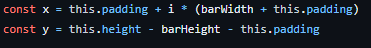
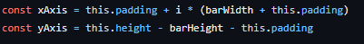
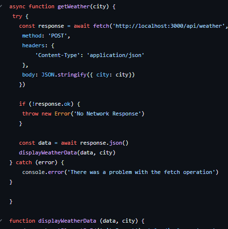
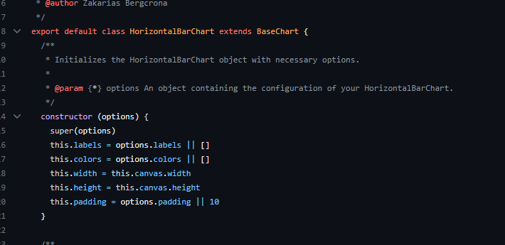
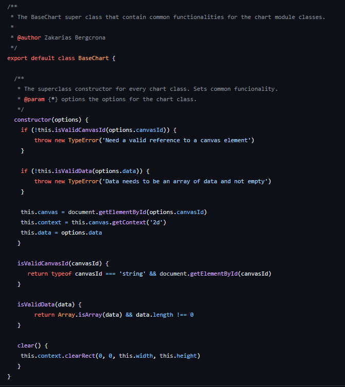
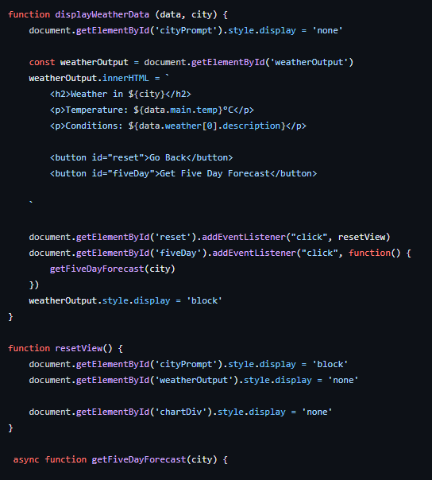
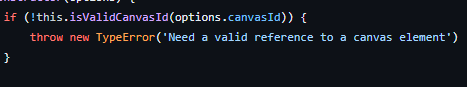
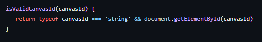

# Reflektion

## Kapitel 2

Som jag nämnt i förra reflektionen så har de namn jag skrivit inte varit “förfärliga” men mycket tanke har inte lagts på att komma fram med “bra” namn på variabler m.m. Den största påverkan detta kapitlet har haft på mig handlar nog mer om att förbättra de sämre namnen, till exempel de namnen som inte är beskrivande och som kan skapa disinformation .

Utöver detta har jag försökt undvika att namnge för mig själv och istället namnge så en annan programmerare ska kunna få en snabb överblick på vad det handlar om samtidigt som jag fortsätter med att till exempel namnge klasser som substantiv och metoder som verb.

## Kapitel 3

Funktionerna storlek, abstraktionsnivå samt syfte var något som var lite huller om buller (och fortfarande är) men som jag nu har försökt bryta ut för att låta funktionerna fokusera på en sak. Ett exempel är: 

där funktionerna fokuserar på en sak (hämta data, visa data) men också på att de är på samma abstraktionsnivå.

I modulen har jag fortsatt med att mestadels ha niladiska funktioner men nu med webbappen var det svårare att hålla ner detta så där blev majoriteten monadiska då det annars blev att funktionerna blev för stora och hade flera ansvarsområden.

## Kapitel 4

Många av JSDOC kommentarerna har mycket redundant information men jag har valt att behålla dem i modul fallet då de både krävs för kodstandarden jag använder men också för att det känns som något som är bra att ha speciellt när man skriver moduler som andra ska använda / api:er. I detta fall hade jag definitivt lagt mer tid på att förbättra dessa kommentarer om jag hade det och ändra flertalet så att de inte bara är “noise”.

## Kapitel 5

Formateringen är något som jag lagt fokus på att förbättra specifikt i modulen men också i webbappen. I modulen har jag nu reducerat duplicerad kod genom att flytta gemensam funktionalitet till en bas klass och låta de andra klasserna extenda denna.

Jag har också försökt lägga de metoder/funktioner som anropar varandra i en ordning så att man tydligt kan läsa och hoppa från funktion till funktion (vertikal distans).

Däremot finns det flertalet exempel där jag skulle kunnat hålla den horisontella formateringen lägre om jag haft mer tid. 

## Kapitel 6

Detta kapitel har påverkat mig lite mindre kanske just för att jag inte jobbar i java utan javascript och bara har fåtalet privata metoder. En sak som jag kan dra en parallell till från detta kapitel är hur arkitekturen är uppbyggd i min Express applikation. Användaren interagerar bara med klient side html:en samt klient side javascripten så där är business logiken separerad (kontroller metoder etc) från de visuella på klient sidan.

Däremot har jag definitivt kunnat tänka mer på The Law of Demeter då jag har flera metoder som inte följer dessa regler. Man kan också dra en parallell från strukturen i express web-appen och i hur data strukturer samt objekt då server sidan har logiken medans klient sidan ändrar det visuella.

## Kapitel 7

Felhanteringen är också något som jag förbättrat både genom att bryta ut denna i en egen metod men också genom att byta från konsol anrop (console.error) till att alltid använda undantag 

Jag har också försökt att låta undantagen beskriva vad problemet är så att en användare av modulen vet vad problemet är. 

En sak som jag skulle kunna förbättra här är att kolla på de try-catch satser som jag har (mest på webbappen) och försöka bryta ut vissa av dessa för att förbättra koden.

## Kapitel 8 

I min modul används inte någon tredjeparts kod utan i detta fall är det väl modulen som är tredjeparts koden i webbappen. Eftersom det var jag som skrev modulen samt att den inte är så komplicerad har jag väl inte direkt gjort några “learning tests” utöver testningen av modulen.

Dock har jag använt mig av OpenWeatherMap API:et i webbappen och kunde kanske där använt mig av denna metod.  Den funktionalitet som detta api erbjuder matchade också den funktionalitet som jag behövde så jag behövde inte direkt “korsa barriären som separerar det kända med det okända”.

Däremot skulle man kunnat planera för framtiden genom att kanske skriva om api anropen till api:n  om den till exempel skulle ändras m.m. 

I detta fallet är jag beroende av kod som jag har skrivit (modulen) men i framtiden kanske man skulle kunna anpassa min kod ännu mer så att så lite av min webbapp interagerar med något som man inte har kontroll över.

## Kapitel 9 

Jag har inte helt följt test driven developments tre regler utan har testat, kodat och planerat lite då och då. Därför har jag inte alltid skrivit ett testfall för alla funktionaliteter då jag ibland har blivit tvungen att ta bort / lägga till saker då jag har planerat. 

Jag har också testat både modulen samt webbappen manuellt och har därför inte skrivit några automatiska enhetstest.

## Kapitel 10

Något som jag har tänkt på efter jag läst detta kapitel är just vilka variabler / metoder som ska vara privata / publika. I min modul är nästan alla metoder publika då det inte finns något behov av privata metoder men när man kommer till variablerna(fält) ser jag att majoriteten av dessa borde vara privata och i vissa fall är det inte det.

Däremot tycker jag att jag har hållit klasserna ganska små speciellt efter att jag flyttade ut kod från alla chart klasserna i modulen till en superclass för att inte använda duplicerad kod.

Jag skulle med mer tid också kunnat bryta ut vissa av funktionerna i modulen till ännu mindre funktioner för att skapa bättre sammanhållning i klasserna.

## Kapitel 11

Något som jag innan denna kurs inte heller hade tänkt på särskilt mycket var just att designa system för framtiden. Webbapplikationen samt modulen har inte designats särskilt mycket för framtiden utan detta är något som jag måste förbättra.

Trots detta tycker jag att mina ändringar i modulen har bidragit till lättare underhållbarhet genom att separera felhantering och bryta ut funktioner/duplicering av kod i en ny basklass.

